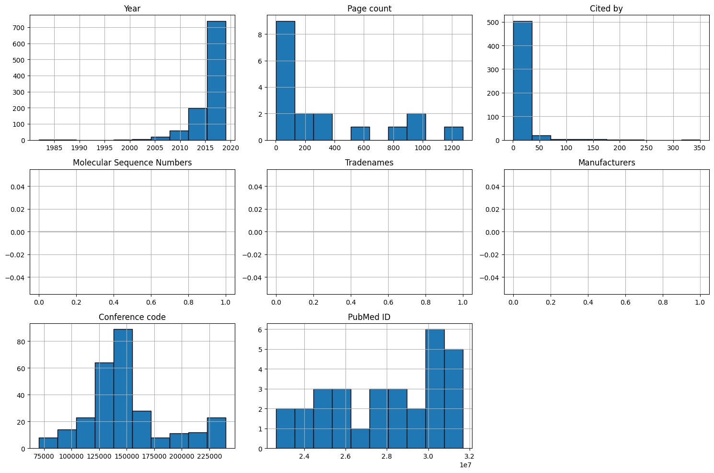
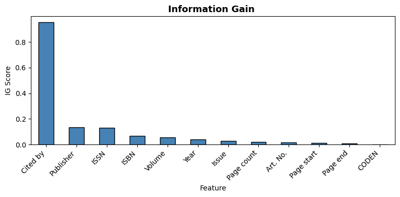
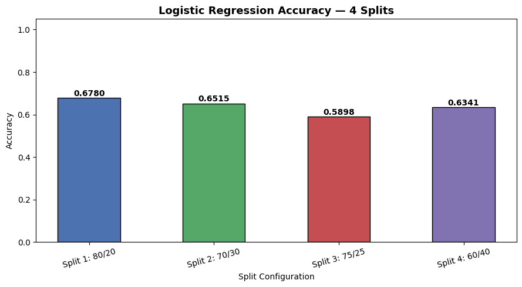

# Digital Marketing Data Mining

A data mining project that analyzes a digital marketing dataset using data preprocessing, exploratory data analysis (EDA), feature selection, and Logistic Regression for customer classification.

---

## Project Overview

This project is divided into two phases:

### Phase 1
- Data loading
- Data cleaning
- Exploratory Data Analysis (EDA)
- Data visualization
- Feature selection

### Phase 2
- Data preprocessing
- Train/Test split
- Logistic Regression model
- Model evaluation
- Performance analysis

---

## Project Structure

```text
DigitalMarketing-Data-Mining/
│
├── data/
│   └── digitalmarketing.csv
│
├── notebooks/
│   ├── phase_1.ipynb
│   └── phase_2_logistic_regression.ipynb
│
├── images/
│   ├── Accuracy.png
│   ├── feature_selection.png
│   ├── logistic_splits.png
│   └── phase1_histogram.png
│
└── README.md
```

---

## Dataset

The dataset contains customer information used for digital marketing analysis and prediction.

---

## Technologies Used

- Python
- Pandas
- NumPy
- Matplotlib
- Seaborn
- Scikit-learn
- Jupyter Notebook

---

# Results

## Phase 1 - Data Distribution



---

## Feature Selection



---

## Logistic Regression Train/Test Split


---

## Model Accuracy



---

## Machine Learning Model

**Algorithm**

- Logistic Regression

**Evaluation Metrics**

- Accuracy Score
- Confusion Matrix
- Classification Report

---

## How to Run

1. Clone the repository

```bash
git clone https://github.com/YOUR_USERNAME/DigitalMarketing-Data-Mining.git
```

2. Install the required libraries

```bash
pip install pandas numpy matplotlib seaborn scikit-learn
```

3. Open Jupyter Notebook

```bash
jupyter notebook
```

4. Run the notebooks in order:

- `phase_1.ipynb`
- `phase_2_logistic_regression.ipynb`

---

## Author

**Yousef Qaisi**

AI Student

---

## License

This project is for educational purposes.
